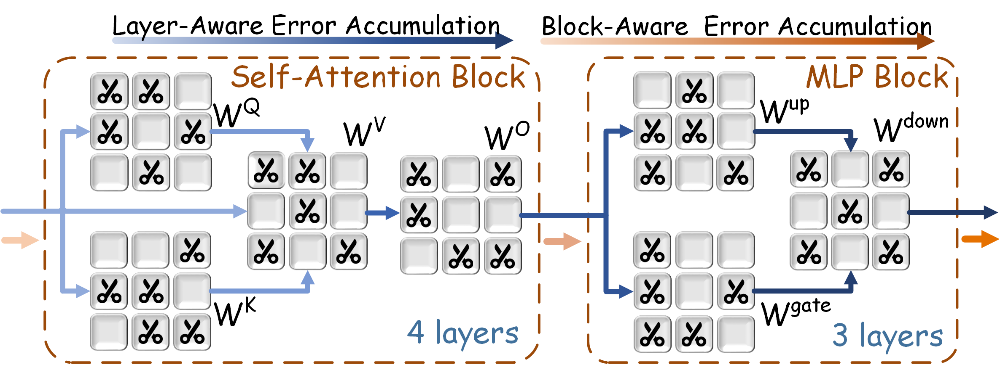
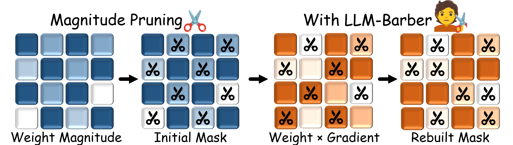

# LLM-Barber
> [LLM-Barber: Block-Aware Rebuilder for Sparsity Mask in One-Shot for Large Language Models [arxiv]](https://arxiv.org/abs/2408.10631)
> 
> *Yupeng Su\*, Ziyi Guan\*, Xiaoqun Liu, Tianlai Jin, Dongkuan Wu, Graziano Chesi, Ngai Wong, Hao Yu (\* indicates equal contribution)*
>
> Southern University of Science and Technology, University of Hong Kong


Transition from the layer-aware to block-aware error accumulation to achieve an optimized global solution.

Rebuilding sparsity mask using a novel pruning metric based on weights multiplied by gradients.

## Setup
To install, follow the instructions in the [INSTALL.md](INSTALL.md) file.

## Usage
The [scripts](./scripts/) directory houses all Bash commands necessary to reproduce the primary findings presented in our paper.

The following command demonstrates pruning LLaMA-7B with LLM-Barber to achieve 50% unstructured sparsity based on initialization method Wanda.

```bash
python main.py \
    --model huggyllama/llama-7b \
    --prune_method wanda \
    --sparsity_ratio 0.5 --sparsity_type unstructured  \
    --prune_barber --prune_granularity output1 --threshold 0.01 \
    --save_model /path/to/save/model --save_ppl /path/to/save/ppl --save_zeroshot /path/to/save/zeroshot \
    --delete
```

Here's an overview of the arguments used in the command:

* `--model`: Specifies the LLaMA model to use from the Hugging Face model hub.
* `--prune_method`: Selects the pruning method, option [`magnitude`, `sparsegpt`, `wanda`].
* `--sparsity_ratio`: Sets the sparsity ratio, meaning the percentage of the weights will be pruned.
* `--sparsity_type`: Specifies the type of sparsity [`unstructured`,`2:4`,`4:8`].
* `--prune_barber`: This flag indicates that the model will be pruned with LLM-Barber.
* `--prune_granularity`: Specifies the granularity of the pruning, option [`block`, `layer`, `output1`, `input1`].
* `--threshold`: Sets the mask rebuilding ratio of LLM-Barber, default is 0.01.
* `--save_model`: Defines the directory where the pruned model will be saved.
* `--save_ppl`: Defines the directory where the perplexity results will be saved.
* `--save_zeroshot`: Defines the directory where the zero-shot results will be saved.
* `--delete`: This flag indicates that the pruned model should be deleted after the experiment. 

This command will run the `main.py` script with the specified arguments, pruning the "huggyllama/llama-7b" model using initialization method Wanda with a sparsity ratio of 0.5 and unstructured sparsity. The results will be saved to the specified directories, and the pruned model will be deleted after the experiment.

To implement structured N:M sparsity, set the --sparsity_type argument to either "2:4" or "4:8". An example command is provided below.
```bash
python main.py \
    --model huggyllama/llama-7b \
    --prune_method wanda \
    --sparsity_ratio 0.5 --sparsity_type 2:4  \
    --prune_barber --prune_granularity output1 --threshold 0.01 \
    --save_model /path/to/save/model --save_ppl /path/to/save/ppl  \
    --delete
```

## Acknowledgement
This repository is build upon the [Wanda](https://github.com/locuslab/wanda) and [SparseGPT](https://github.com/IST-DASLab/sparsegpt) repository.

## License
This project is released under the MIT license. Please see the [LICENSE](LICENSE) file for more information.

## Cite
If you find our work useful, please consider citing our paper:
```bibtex
@article{su2024llmbarber,
    author = {Yupeng Su and Ziyi Guan and Xiaoqun Liu and Tianlai Jin and Dongkuan Wu and Graziano Chesi and Ngai Wong and Hao Yu},
    title = {LLM-Barber: Block-Aware Rebuilder for Sparsity Mask in One-Shot for Large Language Models},
    year = {2024},
    eprint = {arXiv:2408.10631},
}
```

